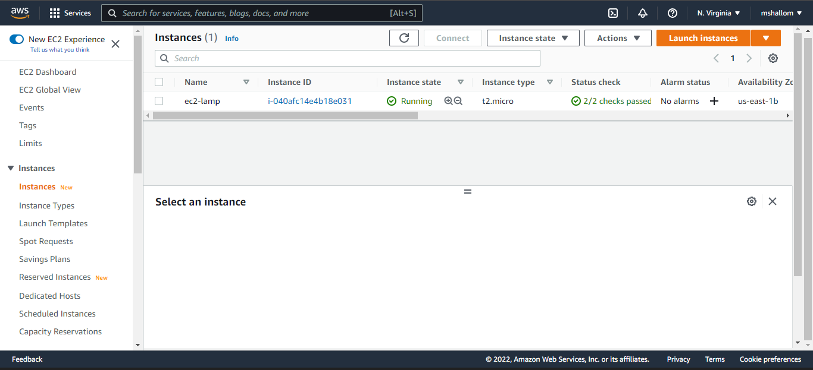

# Deploying a LAMP Stack Web Application on AWS Cloud
***
A LAMP Stack is a solution stack that is being used in deploying web applications. It stands for Linux, Apache, MySql and php,perl or python. 

**Linux**: This is an operating system which serves as the backbone of the LAMP Stack, and it is actively used in deploying other components.

**Apache**: is a web server software which via HTTP requests processes requests and transmits information via the internet.

**MySQL**: use for creating and maintaining dynamic databases. It supports SQL and relational tables and provides a DBMS(Database Management System).

**PHP,PERL or PYTHON**: this represents programming languages which effectively combines all the elements of the LAMP stack and is used to make web applications execute.

## Creation of EC2 Instance
First we log on to AWS Cloud Services and create an EC2 Ubuntu vm instance. When creating instance choose keypair authentication and `download private key(*.pem)` on your local computer.



On windows termainal, `cd` into the directory containing the downloaded private key.Run command to log into the instance via ssh: <br/>

`ssh -i <private_keyfile.pem> username@ip-address`

Successful login into ec2 instance:

## Setting Up Apache Web Server

To deploying the web application, we need to install apache via ubuntu package manager `apt`:
```
#Updating Packages
$ sudo apt update

$ sudo apt install apache2
```


```
#starting apache2 Server
$ systemctl start apache2

#ensuring apache2 starts automatically on system boot
$ systemctl enable apache2

#checking server spunned
$ systemctl status apache2
```


If it shows a green text that means the web server has been successfully spunned and is live.

